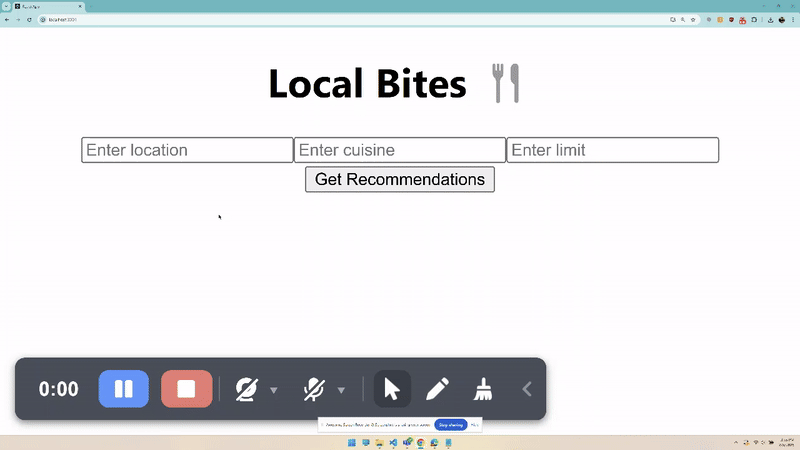

# Food Recipe App

## What
The Food Recipe App is a web application that allows users to search for and view various food recipes. Users can also save their favorite recipes and create a personalized recipe collection.



## How To Run the App
1. **Clone the repository:**
    ```bash
    git clone https://github.com/beijiez/yelp-food-recommendation-demo.git
    ```
2. **Navigate to the project directory:**
    ```bash
    cd food-rec-app
    ```
3. **Start the backend server:**
    ```bash
    cd backend
    npm install express cors axios dotenv
    # Update index.js with the YELP access key
    node index.js
    ```
4. **Start the development server:**
    ```bash
    # in a new terminal
    cd frontend
    npm install axios
    npm start
    ```
5. **Open the app in your browser:**
    Navigate to `http://localhost:3001` in your web browser.

## Resources
- **React Documentation:** [https://reactjs.org/docs/getting-started.html](https://reactjs.org/docs/getting-started.html)
- **Node.js Documentation:** [https://nodejs.org/en/docs/](https://nodejs.org/en/docs/)
- **Recipe API:** [https://www.themealdb.com/api.php](https://www.themealdb.com/api.php)

<details>
  <summary>Click to see App building demo notes</summary>
## Demo notes: HowTo Setup from scratch

```bash
# Make project directory
mkdir client server
```

```bash
cd server
npm install express cors axios dotenv
touch index.js
# edit index.js, use copilot to "Generate a API to call GET on yelp business API to retrieve a list of restaurants given input of 
# location, cuisine, and limit. Show restaurant name, rating, price, and url. Make sure to handle CORS"
node index.js
```

```bash
# Open new terminal
cd client
npx create-react-app .
# In index.js, comment out two reportWebVitals() and 
#   import reportWebVitals from './reportWebVitals';
npm install axios
# edit App.js, use copilot to "generate a form that takes in location, cuisine, and limit
# make sure it gets from the server api /restaurants and serving port 3000
# Restaurant output should have name, rating, price ($), and url"
npm start
Y
```

```bash
# Demo the app
# if times allows, update css using copilot
# Ask for questions, feedback, and suggestions
# "push to git", pass to James
```

</details>